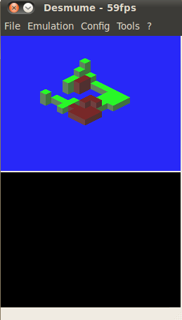
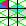

# DS-isometric-tiles
This project is a mock-up of typical isometric perspective games I worked on in my free time, using the tile mode on the nintendo DS, as part of course on micro-embedded programming EE-310 at EPFL, Lausanne.  
This project tries to push to it's limit what can be done using a very small number of tilemap tiles on the DSi software, to create isometric landscape with memory efficiency.

## The project's main challenge
Isometric view(technically Dimetric view in this case, but I will be calling it Isometric to fit the term used in gaming) looks something like this:

The difficulty is I intend to draw it using fixed predefined tiles of 8x8 pixels.
The first observation I made when starting this project is that we can draw the blocks in such a way where each tile is split up to three slices:  
  

If we could paint each individual triangle, we can create the isometric look fairly easily.

## How the code works
### Turning the world into triangles
We start with a 3 dimentional cube world; in the code, it is called `WORLD_MAP`. a 0 in this array means air, a 1 means block 1, a 2, block 2.
We call the function `ISO_GenerateTiles` this function takes this 3D world and converts it into an array of 32x32 squares, from the screens perspective.
These aren't graphical tiles, they store the 3 colors of the triangles that will be in the tile in that location. represented as such:  
|15|14-10|98765|43210|
|---|---|---|---|
|on bit|data top|data middle| data bottom|

where data would look like this: `(01)(001)`  
the bottom 3 bits store the type of the block which had that face, and the top 2 bits store if it was the Top face of a block (FLOOR), the left wall (WALL_LEFT) or the right wall (WALL_RIGHT). (11) is undefined.  

### Converting triangles into tiles
The following code exists inside `ISO_RenderTiles`.
we now have a `u16` array of the triangles in our screen which we need to convert to tiles.  
**we can now observe an issue:** there are many combinations of triangle colors that can fit into one tile. we need to have a different tile for each combination  
The solution is to cleverly use Palettes to allow you to switch around colors.

**observation:** there are some impossible combinations for triangles, such as  
Floor 1 /  
  /-- Wall 2  
Wall 1 \\--  
If a floor cuts above another block, it will have its own wall under it. so there is no way Wall 2 can be directly under floor 1.  
We can use this to map out the possible combinations and split them to an ordering that is logical.  

#### Our division
Tiles are split into **which colors repeat themselves on the tile**: AAA, AAB, ABA, ABB, ABC  
In total, I have configured 25 different tiles:  
 - AAA: FULL
 - ABA: F1F2F1, F1W1F1, W1F1W1
 - AAB: F1F1F2, F1F1W1, W1W1X {W1W1F2, W1W1(W1b), W1W1W2, W1W1D, (W1b)(W1b)W1}
 - ABB: F1W1W1, XF2F2 {F1F2F2, DF2F2, WFF{_W1DD, _W2F2F2, _W1F2F2}
 - ABC: F1F2F3, F1F2W2, W1F2F3{_W2F2F3, _W3F2F3, _W1F2F3} ,DF2F3, DF2W2, W1DF3

_note:_ where i wrote xyz{_1, _2, _3,...} this is one type of combination that had too many permutations to fit under one tile, so i split it into several sub cases.

#### Our palette
|colors\\Palettes| 0 | 1 | 2 | 3 | 4 | 5 | 6 | 7 |
|---|---|---|---|---|---|---|---|---|
| 0 |Water|Water|Water|Water|Water|Water|Water|Water|
| 1 | F1 | F1 | F2 | F2 | Sand | Sand |_W1r_|_W2r_|
| 2 | F2 | Sand | F1 | Sand |  F1 | F2 |_F2_|_Sand_|
| 3 | Sand | F2 | Sand | F1 | F2 | F1 | _Sand_ | _F1 |
| 4 | F1 | F1 | F2 | F2 | F2 | F1 | F1 | F2 |
| 5 | W1 | W1 | W2 | W2 | W2b | W1b | W1b | W2b |
| 6 | W2 | W2b| W1 | W1b | W1 | W2b | W2 | W1b |
| 7 | D | F1 | F2 | Sand | W1 | W1b | W2 | W2b |

- notice how with the rows 234, col 0-5, we can represent all permutations of (f1, f2, sand), which are all our floors.
- row 7 is used for all 8 colors
- row 0 is used exclusively for water
- rows 4+5 combine floors with their own 2 walls, and row 6 gives walls of the opposite floor color.
- The end of rows 234 is used for edge cases between walls and floors

### technical limitations
Since every combination has to be accounted for with the addition of more palettes or more tiles, the amount of different blocks you can implement is very limited.  
Additionally, Mapping the right palette for the combination of the tiles is a very arduous process, in some cases, requiring 8 if statements, for every palette outcome.  
Lastly, tile mode on the DS does not allow affine matrix transformations, so the only method to zoom is by doubling the size of each block.
### conclusion
For the above reasons, I would suggest **not** to implement isometric or complex views in Tile mode, but rather use **Rotoscope** after the Triangle Generation step.  
It is worth noting however, that this implementation takes up a mere _800B_ for the tiles and _128B_ for the palette, as opposed to the _24KB_ of a rotoscope background.  also, consider that you may need to use two backgrounds in order to hide sprites behind some, effectively doubling the amount of memory*  
*- in rotoscope, it is possible to "mask" a second layer only around sprites, however if there is more than one on screen, there is no choice but to use the whole 24KB
